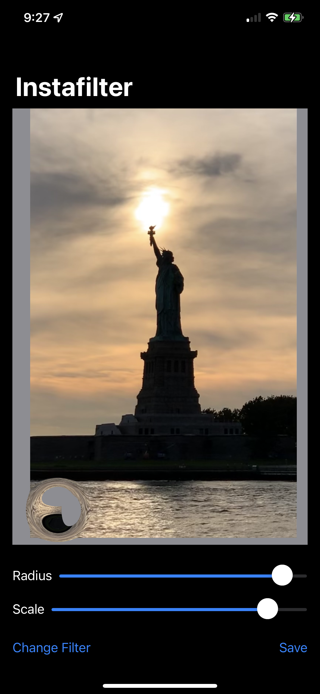
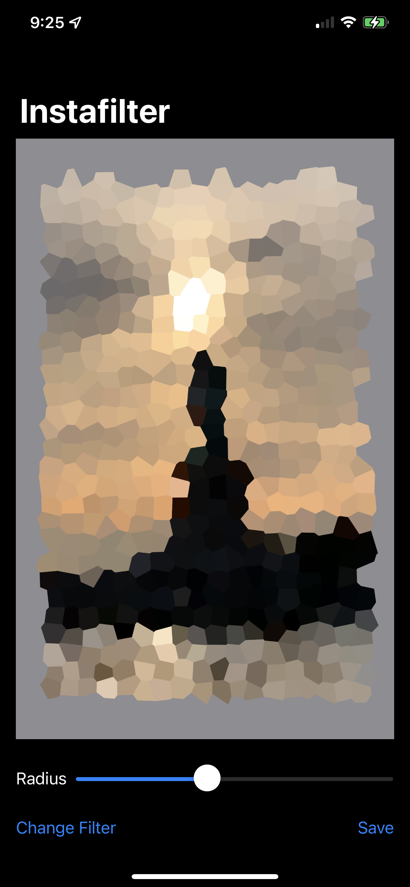

# InstaFilter
Core image filter program for photos. Project 13 days 62 - 67 of 100 days of swiftUI.

This project focused on leveraging CoreImage to apply filters to saved images on an iPhone. It also includes the code for accessing and saving new photos.

 

## Filter Images

Notes for how I implemented the challenges can be found in the code, feel free to use and expand upon them. Keep on learning!

## TODO
1. Change the title line to show what filter is currently being applied
2. Wrap up the useful code here and add it to [PeteBits](https://github.com/PeterH33/PeteBits) Load images, filters, and saving images are all overly complicated and could do with being changed to a wrapper for future use.
3. Make more sliders for Bump Distortion so that it could be more helpful
4. Implement the rest of the filters and get them wrapped up nice.

*NOTE* This project has a lot of fun code that I want to use further, need to remember and come back to this one to refine it.
